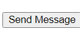
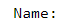
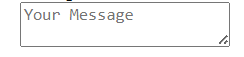

***Description:*** Create a simple contact form with fields for name, email, message, date,age,color, username, password.. using label and input tags.
# Student form
        ![alt text] (Screenshot_19-10-2024_123324_drive.google.com.jpeg)
******                    ********           *******

 <input type="submit" value="Send Message">

<label for="message">Message:</label>

<textarea id="message" name="message" placeholder="Your Message"></textarea>  

******                    ********           *******
__Why Use a Form?__
Using a form in HTML is essential because:

It enables you to collect data from users systematically.
It supports various input types (like text, email, date, etc.) and allows for structured validation.
It provides a clear mechanism for data submission to a server or for client-side processing.
